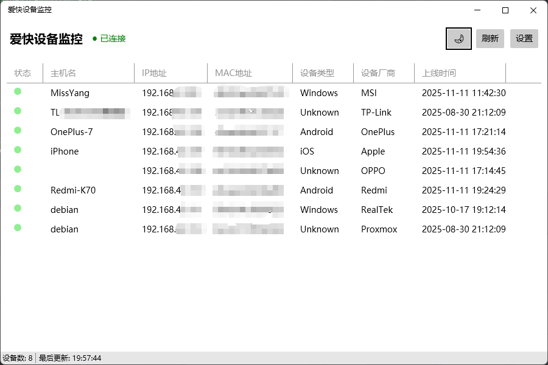
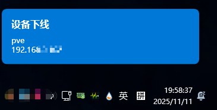

# 爱快设备监控

 -->

基于 C# WPF 的爱快路由器设备上线/离线监控桌面应用程序。

## 功能特性

- ✅ 爱快路由器 API 集成（登录认证、设备监控）
- ✅ 实时设备状态监控（上线/下线检测）
- ✅ Toast 风格桌面通知
- ✅ 全屏应用检测并自动抑制通知
- ✅ 系统托盘集成
- ✅ 开机自启动
- ✅ 单实例运行
- ✅ ModernWPF 现代化 UI
- ✅ 明暗主题支持
- ✅ 异步文件 I/O，无 UI 冻结

## 系统要求

- Windows 10/11 x64
- [.NET 9 Desktop Runtime](https://dotnet.microsoft.com/download/dotnet/9.0)

## 快速开始

### 下载安装

1. 从 [Releases](../../releases) 下载最新版本 `IKuaiDeviceMonitor.exe`
2. 安装 .NET 9 Desktop Runtime（如未安装）
3. 运行 `IKuaiDeviceMonitor.exe`

### 配置

首次运行点击"设置"按钮配置：

| 配置项      | 说明            | 示例                          |
|----------|---------------|-----------------------------|
| 路由器地址    | 爱快路由器 IP 地址   | `192.168.1.1`               |
| 端口       | HTTP/HTTPS 端口 | `443` (HTTPS) / `80` (HTTP) |
| 使用 HTTPS | 是否使用 HTTPS 连接 | ✅ 推荐                        |
| 用户名      | 路由器管理员账号      | `admin`                     |
| 密码       | 路由器管理员密码      | -                           |
| 检查间隔     | 设备状态检查间隔（毫秒）  | `30000` (30秒)               |
| 启用通知     | 设备上线/下线时显示通知  | ✅                           |
| 全屏时禁用通知  | 全屏应用时不显示通知    | ✅                           |
| 开机自启动    | 随 Windows 启动  | -                           |
| 最小化到托盘   | 最小化时隐藏到系统托盘   | ✅                           |

## 使用说明

1. 启动应用程序
2. 点击"设置"配置路由器连接信息
3. 应用自动开始监控设备状态
4. 设备上线/下线时显示桌面通知
5. 最小化到系统托盘继续运行
6. 双击托盘图标恢复窗口

## 配置文件位置

- 配置文件: `%AppData%\IKuaiDeviceMonitor\config.json`
- 设备状态: `%AppData%\IKuaiDeviceMonitor\devices.json`

## 截图

## 常见问题

**Q: 连接失败怎么办？**  
A: 检查路由器地址、端口、用户名密码是否正确，确保网络连通。

**Q: 通知不显示？**  
A: 检查"启用通知"是否勾选，全屏应用时通知会被抑制。

**Q: 如何卸载？**  
A: 删除程序文件和 `%AppData%\IKuaiDeviceMonitor` 目录即可。
